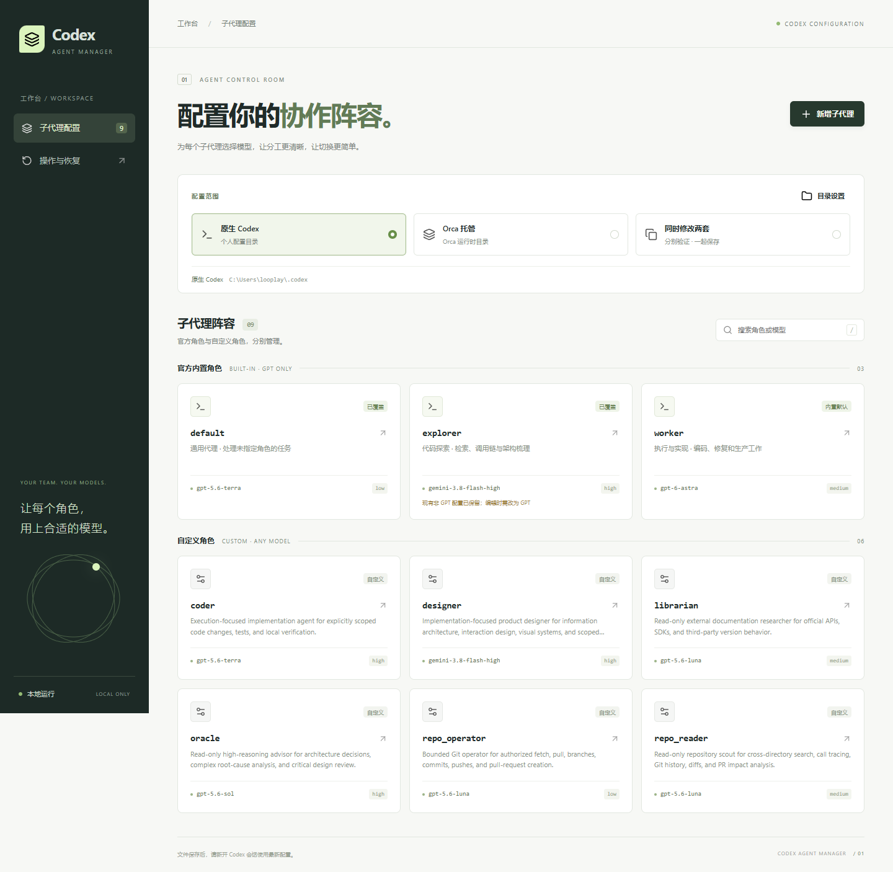

# Codex Agent Manager

用一个本地 Web 面板管理 **原生 Codex / Orca 托管 Codex** 的子代理。点击选择模型、编辑角色、验证连接，无需为修改配置再启动一个 Agent 会话。

[下载 Windows 便携版](https://github.com/MadebyNight/codex-agent-manager/releases/latest) · [版本记录](https://github.com/MadebyNight/codex-agent-manager/releases) · [反馈问题](https://github.com/MadebyNight/codex-agent-manager/issues)

当前源码版本为 **v0.1.1**，包含 Orca 共用角色文件修复和服务商模型列表读取。更新内容见 [版本说明](docs/releases/v0.1.1.md)；已发布的安装包以 [Releases](https://github.com/MadebyNight/codex-agent-manager/releases) 页面为准。



## 下载即用（Windows x64）

1. 打开 [Releases](https://github.com/MadebyNight/codex-agent-manager/releases/latest)，下载该版本的 **`codex-agent-manager-v*-windows-x64.zip`**，不要下载 GitHub 自动生成的 Source code 包。
2. **完整解压**到可写目录，保留 `_internal` 文件夹，双击 **`CodexAgentManager.exe`**。
3. 浏览器自动打开 `http://127.0.0.1:8765`。确认 Codex 配置目录，未安装的一套取消启用，然后点击“保存并使用”。
4. 点击角色 → 选择或输入模型 → 预览变更 → 测试连通性 → 确认保存。

**便携版内置运行环境，无需安装 Python、Node.js 或依赖。** 程序启动不依赖网络；打开页面后会尝试向已配置的服务商获取模型列表。模型测试也需要连接服务商，并产生少量 API 用量。请先在本机安装并配置 Codex，使用 Orca 的用户还需已有 Orca Codex 配置。

关闭浏览器不会退出后台。双击 **停止面板.cmd** 可退出，再次双击 EXE 会打开已有面板。设置与备份位于解压目录的 `.local`；更新前停止旧版，保留该目录，再替换程序文件。

| 支持范围 | 说明 |
|---|---|
| 发布平台 | Windows 10/11 x64；不需要管理员权限 |
| 配置范围 | 原生 / Orca / 两套同时修改；也可仅启用一种 |
| 自定义模型 | 不限厂商或名称，手动输入模型 ID，实际连接测试通过后保存 |
| 官方角色 | `default`、`worker`、`explorer`，本工具限定为 GPT 系列 |
| 服务商 | 已有 API Key 认证的 Responses 兼容服务；不管理 OAuth 登录 |
| 配置兼容 | 按 Codex 0.155.1 核查；其他版本请先确认角色配置格式 |

### 主要功能

- 点击即展开模型列表，支持搜索、键盘选择与任意模型 ID。
- 新增、编辑、删除自定义角色；为官方角色设置覆盖或恢复默认。
- 自动识别配置目录，支持本机文件夹选择并记住设置。
- 双套配置显示差异，只同步本次编辑字段，保留其他内容和 TOML 注释。
- 保存前展示变更，自动备份；写入失败回滚，支持恢复最近一次操作。

这是独立社区工具，与 OpenAI、Orca 无隶属或官方背书关系。

## 从源码启动（开发者）

Windows 安装 Python 3.11+ 后，双击 **启动面板.cmd**。首次启动在项目 `.venv` 安装唯一运行依赖 `tomlkit`，之后离线启动，无需 Agent 会话。

访问 http://127.0.0.1:8765 。关闭浏览器不会停止后台服务；双击 **停止面板.cmd** 可停止。重复启动会打开已有面板。

终端前台启动：`.venv\Scripts\python.exe -B -m app.server --open`。

## 首次设置与分发

首次打开会显示两套配置的检测结果。可以直接输入目录，或点击“选择”打开本机文件夹选择器；请选择包含 `config.toml` 的文件夹，而非 `agents` 子目录。

点击“检测目录”查看配置是否可读、角色定义是否有效。只安装一种工具时，取消启用另一套即可。保存会再次验证，拒绝重复、相互嵌套或共享 agents 链接的双套目录。这里只记住目录，不创建或修改 Codex 配置。

选择保存在项目 `.local/settings.json`，下次启动优先使用。面板右上方“目录设置”可随时调整，也可恢复到本次启动自动检测到的路径。切换目录立即生效，并清除旧预览与测试凭据；操作记录按当前目录过滤，原备份文件保留。

向同事分发时，推荐直接发送 Release ZIP。若分发源码，**排除 `.venv`、`.local` 和 `.git`**；源码运行需要 Python 3.11+。不要分发个人目录设置、日志、认证或配置备份。

当前面向 Windows 本机配置，不自动遍历 Orca 多账号目录，不扫描 WSL 或项目级 `.codex/agents`。特殊目录可手动指定；没有安装 Codex 或尚未产生 `config.toml` 时，面板会明确显示未找到配置。内置角色清单按已核查的 Codex 0.155.1 定义，不宣称动态适配所有版本。

## 范围与操作

- 原生：默认 `%USERPROFILE%\.codex`；若 `CODEX_HOME` 指向非 Orca 目录，则使用该自定义目录。由 Orca 注入的运行时目录不会被当成原生配置。
- Orca：优先 `ORCA_CODEX_HOME`，否则 `%APPDATA%\orca\codex-runtime-home\home`。
- 同时修改两套：仅同步编辑过的字段，其余差异保留。目标一边缺失的自定义角色，以表单显示内容创建；预览列出全部文件。
- 官方角色 `default` / `worker` / `explorer`：仅允许 `gpt-` 开头的模型 ID，可调整推理强度，恢复默认移除覆盖，内置角色仍存在。GPT 限制是本工具产品规则，不宣称为 Codex 官方限制。
- 自定义角色：名称、描述、模型、推理强度、权限、提示词；不限模型类别，必须通过目标服务商的实际请求测试才能保存。已有名称不可重命名，避免更改调用方引用。
- 官方角色现有非 GPT 值只读展示、原样保留；编辑时要求改为 GPT，不会在启动时自动改写。
- 单文件原子替换；双套写入失败回滚。每次先备份，支持恢复最近一次操作。页面打开后文件被外部修改，保存会拒绝覆盖。
- 自定义 TOML 保留未知字段、注释和换行风格。已有 `[agents.<name>].config_file` 声明可读取与编辑；新增官方角色覆盖通过此机制保存模型与推理参数，不使用空提示词覆盖继承指令。

仅管理用户级 Codex 配置。不修改业务仓库、MCP、Skills、主模型或服务商配置；创建/移除官方覆盖时只修改主配置中的对应 `[agents.<name>]` 声明。Orca 角色引用所选原生 Codex 目录中的同一文件时，可在“同时修改两套”范围编辑，文件只写入和备份一次；单独修改该角色会被阻止，新增其他角色不受影响。其他目录外的 config_file 引用、共享链接或存在重复/损坏定义的配置仍不支持编辑。

## 连通性测试

点击“预览变更”→“测试连通性”，面板复用目标配置的服务商、API Key、环境变量、HTTP headers、query params，以及角色已有的服务商覆盖。请求 `POST /responses`，使用候选模型和推理强度，以 256 输出 Token 为预算请求简单文本。每套配置最长等待 45 秒，会产生少量服务商用量。不会启动 Codex 或子代理。

通过标准为成功返回可解析的 Responses 数据和非空文本，HTTP 200 本身不算通过。测试绑定候选模型、参数、地址和认证，10 分钟有效；全部目标通过后才能保存。

本版支持已有 API Key 认证的 Responses 兼容服务商；不管理服务商、不刷新 ChatGPT OAuth、不支持 Bedrock 专用认证。测试通过只证明文本生成可用，不能证明完整 Codex 工具调用兼容。高推理强度可能耗尽测试预算而不输出文本，面板会明确报告未通过。

密钥只在后端读取，不返回浏览器，不记录到服务日志。API 原始错误体不直接展示，避免上游代理回显凭据。

## 配置生效与 Orca

Codex 0.155.1 源码显示，已登记角色的文件会在创建新的子代理时重新读取；已运行的子代理不会因此自动换模型。新增角色、首次创建覆盖或恢复默认建议重新加载 Codex 会话；此结论尚未对每种 Orca 启动方式实测。Orca 可能随版本、账号或配置同步切换运行目录；面板明确显示目标路径，不修改 Orca 私有设置，不宣称已阻止它未来同步覆盖配置。若 Orca 切换账号，可在“目录设置”中选取当前账号的 Codex 配置目录。

面板只管理所选 Codex 目录中的角色；skills 和 plugins 不在修改范围。

## 备份与恢复

本地 `.local/backups/*.json` 保存写入前后内容，不纳入 Git。备份可能包含 TOML 原有敏感配置，不要分享该目录。事务中断时下次启动检查 pending 记录；文件仍匹配事务前后状态才自动回滚，否则停止写入并提示人工检查。恢复会创建新的备份，因此可撤销恢复。

## 验证

`.venv\Scripts\python.exe -B -m unittest discover -s tests -v`

测试使用临时 Codex homes 和本地模拟 Responses 服务，不访问真实服务商、不改写真实配置。浏览器验收通过可选的 Playwright 开发依赖执行，详情见 `tests/browser_check.py`。

浏览器测试：安装 `requirements-dev.txt` 后，运行 `.venv\Scripts\python.exe -B -m tests.browser_check --browser "本机 Chromium 的完整路径"`；也可省略 `--browser` 使用已安装的 Playwright Chromium。验收截图：[桌面预览](docs/preview-desktop.png)、[窄屏预览](docs/preview-mobile.png)。

## 自行构建发布包

在 Windows x64、Python 3.11+ 环境执行：

```powershell
python -m venv .venv
.venv\Scripts\python.exe -m pip install -r requirements-build.txt
.venv\Scripts\python.exe scripts/build_release.py
```

输出位于 `dist/`：便携 ZIP 和 `SHA256SUMS.txt`。构建脚本仅打包程序、Web 资源及许可证，不包含 `.local`、个人配置、凭据或开发虚拟环境。

便携包验证：`.venv\Scripts\python.exe -B -m tests.portable_check dist\codex-agent-manager-v0.1.1-windows-x64.zip`。测试在临时目录解压，使用模拟配置及本地模型服务，并在 PATH 不含 Python/Node.js 的条件下启动实际 EXE。

## 常见问题

**找不到配置目录？** 在“目录设置”中选择包含 `config.toml` 的文件夹。Orca 多账号或自定义目录可手动指定；不需要两种工具都安装。

**模型不在下拉列表里？** 面板会向所选 Codex 配置中的服务商地址请求 `GET /models`；服务商不支持该接口或网络不可用时，仍显示已有配置中使用的模型。自定义角色可以直接输入任何模型 ID，再执行连接测试。推理强度仅在服务商返回 `supported_reasoning_levels` 时按模型筛选，否则显示通用选项。

**启动后没有打开页面？** 手动访问 `http://127.0.0.1:8765`，并检查解压目录 `.local/server-error.log`。端口被其他程序占用时可从终端执行 `CodexAgentManager.exe --port 8876`；退出对应实例使用 `CodexAgentManager.exe --port 8876 --stop`。

**需要重启 Codex 吗？** 已登记角色的模型修改会在后续新建子代理时读取；已运行的子代理不会自动换模型。新增或删除角色、恢复内置默认建议重新加载 Codex 会话，详见下方参考文档。

**可以在 macOS、Linux 或 WSL 使用吗？** 当前发布包仅支持 Windows x64，尚未适配其他平台。

## 许可证与参考资料

项目代码使用 [MIT License](LICENSE)。第三方组件及官方角色描述的许可证见 [THIRD_PARTY_NOTICES.md](THIRD_PARTY_NOTICES.md)。

- [Codex 子代理](https://developers.openai.com/codex/subagents)：内置角色、独立 agents TOML、配置继承。
- [Codex 配置参考](https://developers.openai.com/codex/config-reference)：agents config_file、模型服务商与认证字段。
- [Responses Create](https://developers.openai.com/api/reference/resources/responses/methods/create)：测试请求和输出结构。
- [Codex 官方角色源码](https://github.com/openai/codex/blob/main/codex-rs/core/src/agent/role.rs)。
- [TOML Kit](https://github.com/python-poetry/tomlkit)：保留格式的 TOML 编辑。

图标使用 Lucide 0.468.0，许可证见 `web/icons/LICENSE`。页面资源均本地提供，无 CDN 运行依赖。
